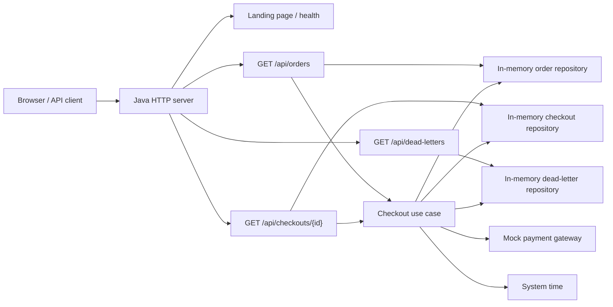

# Architecture Diagram

## Notes

- The server is a JDK `HttpServer` entry point, not Spring Boot.
- The implementation uses in-memory repositories and a mock payment gateway for demo behavior.
- The landing page at `/` is a simple HTML overview, while the API lives under `/api/*`.
