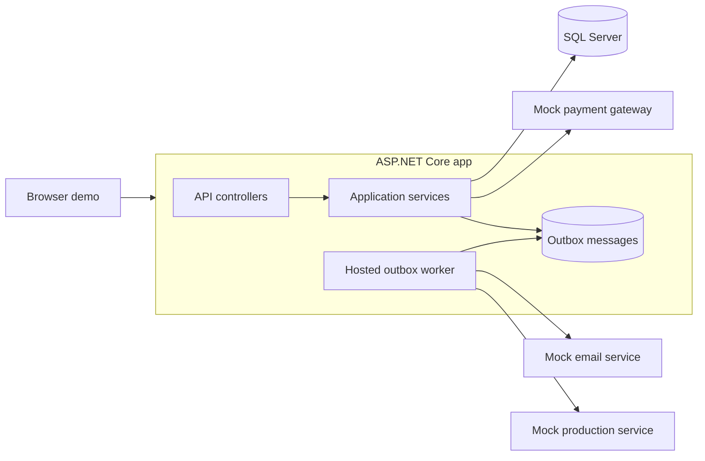

# System Design

## Overview

This repo contains an ASP.NET Core API and a small browser demo for searching orders and running checkout.

It stores data in SQL Server, records checkout attempts and payment results, and exposes endpoints to view orders, run checkout, view checkout results, and see failed outbox messages.

For this demo, payment, email, and production integrations are mocked. The production integration is responsible for invoice creation. After a successful payment, the repo saves follow-up work to an outbox table and a background worker sends that work to the mocked services.

## Architecture

See [01-architecture-diagram.png](</abs/path/d:/Code/ManagementPlatform/docs/01-architecture-diagram.png>).



## System Design Decisions

### Application Structure

This repo runs as one ASP.NET Core application, but the code is split into separate projects with clear responsibilities.

This fits the current checkout flow because a few things need to stay in sync:

- order status
- payment result
- email work
- production handoff

Keeping this in one application makes the first version easier to build, test, deploy, and run locally. It also avoids the extra complexity of microservices too early.

The code is split into these parts:

- `Domain`: business objects
- `Application`: business flow, use cases, and ports
- `Infrastructure`: SQL Server persistence, mock integrations, background worker, and supporting system services
- `Api`: web host, REST controllers, middleware, and the browser demo

The checkout and order logic depends on interfaces, not directly on ASP.NET Core, SQL Server, or the mock integrations.

In this project:

- `Domain` and `Application` are the core
- `Api` and `Infrastructure` are around the core

The `Application` project defines the ports it needs, for example:

- `IUnitOfWork`
- `IOrderRepository`
- `ICheckoutRepository`
- `IDeadLetterRepository`
- `IClock`
- `IPaymentGateway`
- `IEmailSender`
- `IProductionClient`

The outer layers implement these interfaces:

- `Api` is the inbound web layer. It hosts the REST controllers, exception middleware, and the static browser demo, and it wires requests into the application services.
- `Infrastructure` contains the outbound and technical adapters. It implements the repositories, EF Core `DbContext`, SQL Server setup, mock integrations, system clock, and the hosted outbox worker.

This keeps business logic in the application layer and makes the outer pieces easier to replace without changing the core flow.

Current project structure:

```text
Domain
  Business objects and enums

Application
  Use cases
  Ports
  DTOs and shared application types

Api
  Web host
  REST controllers
  Error handling
  Static demo files

Infrastructure
  EF Core persistence
  SQL Server setup and migrations
  Mock external service adapters
  System clock
  Outbox worker
```

### SQL Server and Data Model

The SQL Server schema and table details are documented separately in [03-data-model.md](/abs/path/d:/Code/ManagementPlatform/docs/03-data-model.md).

## HTTP API

The API endpoints and request examples are documented separately in [04-api.md](/abs/path/d:/Code/ManagementPlatform/docs/04-api.md).

## Flow Sequence

The end-to-end flow sequence is documented separately in [05-flow-sequence.md](/abs/path/d:/Code/ManagementPlatform/docs/05-flow-sequence.md).

## Performance and Reliability

Performance and reliability details are documented separately in [10-performance-reliability.md](/abs/path/d:/Code/ManagementPlatform/docs/10-performance-reliability.md).

