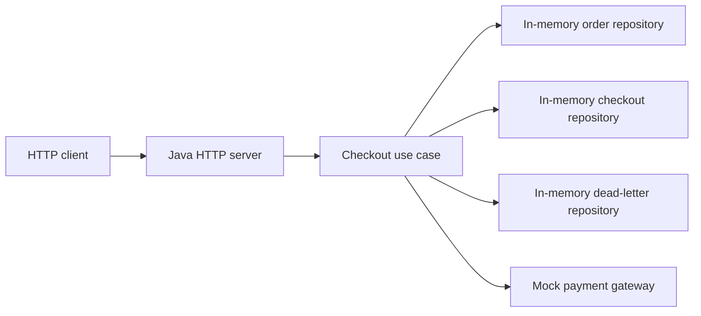

# System Design

## Overview

This repo contains a Java 21 demo API for searching orders, checking out orders, viewing checkout state, and listing dead letters.

The demo uses the JDK HTTP server and in-memory repositories seeded at startup. Payment behavior is mocked so the API can demonstrate success, terminal failure, and retry-like outcomes without external services.

## Architecture



## Application Structure

Current project structure:

```text
src/main/java/com/managementplatform
  ManagementPlatformApplication.java  HTTP entry point and route handlers
  domain                            Domain models and enums
  application                       Use cases, DTOs, and ports
  infrastructure                    In-memory repositories and mock gateway
  shared                            Shared exceptions
```

The application layer depends on ports (`OrderRepository`, `CheckoutRepository`, `DeadLetterRepository`, `PaymentGateway`, and `TimeProvider`) rather than concrete infrastructure classes. The Java entry point wires those ports to in-memory adapters for the demo.

## Data Model

The in-memory model is documented in [03-data-model.md](03-data-model.md).

## HTTP API

The API endpoints and request examples are documented in [04-api.md](04-api.md).

## Flow Sequence

The end-to-end flow sequence is documented in [05-flow-sequence.md](05-flow-sequence.md).
