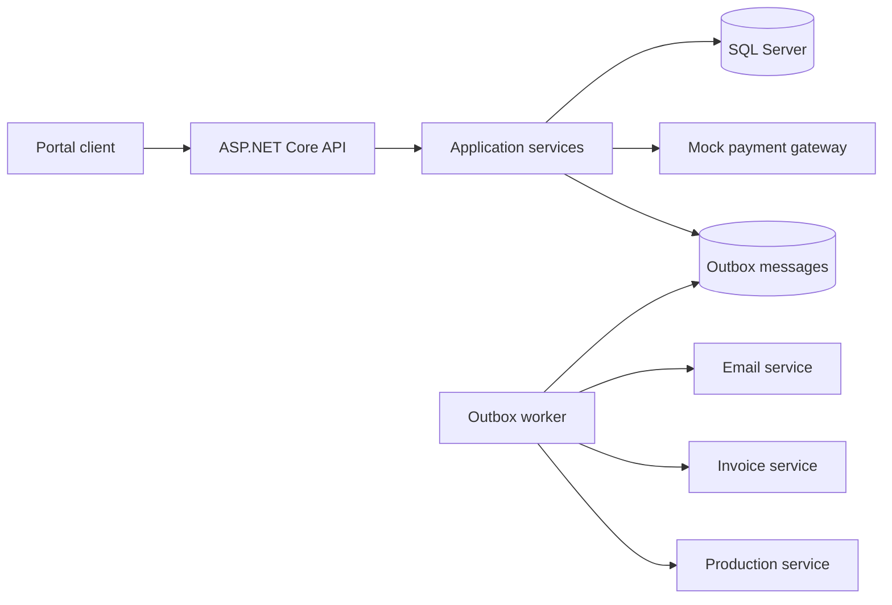
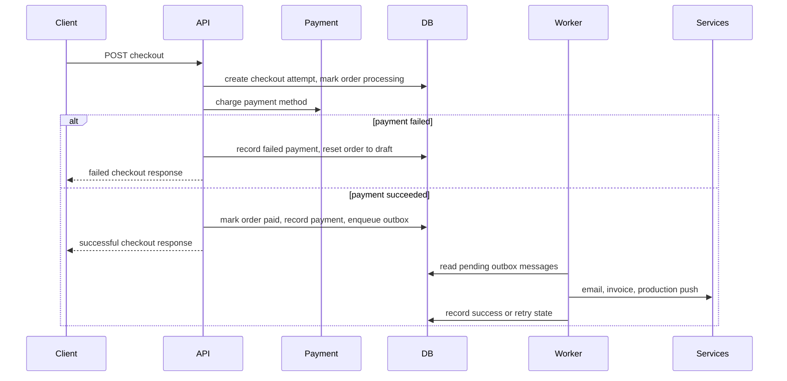

# System Design

## Overview

This system lets clients search for the orders they already created and check them out.

Clients can find an order by name. When they check out an order, the system tries to charge the payment method. If payment succeeds, the system marks the order as paid, sends a success email, creates invoice work, and pushes the order to the Production system for processing.

The external systems are mocked in this project. Payment, email, invoice, and Production calls are not hard-coded inside the checkout request. After successful payment, the system stores the follow-up work in an outbox table. A background worker reads that table and sends the work to the mocked services.

The checkout flow is idempotent. Each checkout request uses an `idempotencyKey`. If the same order is checked out again with the same key, the system returns the original checkout result instead of charging payment again. If the order is already paid or processing and a different key is used, the system rejects the request.

This demo retries payment only for temporary failures that are marked retryable by the payment gateway. The retry is bounded by configuration, so the system stops after a small number of attempts. If payment still fails, the checkout is marked failed and the order goes back to `Draft`.

## System Design Decisions

### Modular Monolith

A modular monolith means the system runs as one application, but the code is split into clear modules.

I chose this because the checkout flow has a few things that need to stay in sync:

- order status
- payment result
- invoice work
- email work
- production handoff

Keeping this in one application makes the first version easier to build, test, deploy, and run locally. It also avoids the extra complexity of microservices too early.

A team of 10-20 engineers can still work well in this structure because the code is split into clear parts:

- `Domain`: business objects
- `Application`: business flow and use cases
- `Infrastructure`: database and external service code
- `Api`: HTTP controllers

If the system grows later, these modules can still be moved out into separate services.

### Hexagonal Architecture

Hexagonal architecture explains how the code depends on other code.

The main rule is simple: business logic should not depend directly on the database or external services.

In this project:

- `Domain` and `Application` are the core
- `Api` and `Infrastructure` are around the core

The core defines interfaces for things it needs, for example:

- `IOrderRepository`
- `ICheckoutRepository`
- `IPaymentGateway`
- `IEmailSender`
- `IInvoiceClient`
- `IProductionClient`

The outer layers implement these interfaces:

- `Api` is the inbound adapter. It receives HTTP requests and calls the use cases.
- `Infrastructure` contains outbound adapters. It has EF Core repositories, SQL Server setup, mock external services, and the outbox worker.

This helps keep business logic in one place. It also makes it easier to replace one external system with another later.

Current project structure:

```text
Domain
  Business objects and enums

Application
  Use cases
  Ports
  DTOs

Api
  REST controllers
  Error handling

Infrastructure
  SQL Server adapter
  Mock external service adapters
  Outbox worker
```

### SQL Server

SQL Server is a good fit here because the data is relational and checkout needs transactions.

The main tables are customers, orders, checkout attempts, payment transactions, invoice requests, and outbox messages. These records have clear relationships.

SQL Server gives us:

- transactions
- unique constraints for idempotency
- indexes for order search
- EF Core migrations
- durable storage for outbox messages

The most important part is that a successful checkout can update the order and create the outbox messages in the same database save. That means we do not mark an order as paid and then forget to create the invoice, email, or production work.

## Components



## Data Model

- `Customer`: customer name and email.
- `Order`: order name, amount, currency, status, customer, and paid time.
- `CheckoutAttempt`: one checkout request for an order and idempotency key.
- `PaymentTransaction`: the payment result for a checkout.
- `InvoiceRequest`: invoice work created after successful payment.
- `OutboxMessage`: email, invoice, or production work waiting to be sent.
- `DeadLetterMessage`: outbox work that failed too many times and needs manual review.

Rules:

- `(OrderId, IdempotencyKey)` is unique, so the same checkout request is not processed twice.
- If payment fails, the failed payment is stored and no email, invoice, or production work is created.
- If payment fails because of a temporary retryable error, the system retries the payment a few times before marking it failed.
- If payment succeeds, the order is marked as `Paid`, the payment is stored, and three outbox messages are created.
- A paid or processing order cannot be checked out again with a different idempotency key.
- If an outbox message reaches its retry limit, it is marked `Failed` and copied to the dead letter table.

## Data Integrity

This demo already includes a few important controls for data integrity, and the same ideas can be extended for a real project.

- Checkout is idempotent. The same order and `idempotencyKey` cannot create duplicate checkout records.
- The database has unique constraints for important fields such as customer email, payment provider transaction id, invoice external id, and `(OrderId, IdempotencyKey)`.
- The checkout flow stores payment state and outbox messages in the same save operation after successful payment.
- If payment fails, the order is moved back to `Draft` and no email, invoice, or production work is created.
- Temporary payment errors can be retried in the same checkout flow, but only up to the configured limit.
- A paid or processing order cannot be checked out again with a different key.
- Foreign keys keep the relationships between order, checkout, payment, invoice, and outbox data valid.
- Outbox messages that exhaust their retry limit are moved into a dead letter table so they are not lost.

For a real project, I would manage data integrity with these rules:

- Keep a clear state machine for orders and checkouts. Only allow valid moves such as `Draft -> CheckoutProcessing -> Paid -> ProductionQueued`.
- Use database constraints first, not only application checks. Unique indexes and foreign keys should block bad writes even if application code has a bug.
- Keep checkout idempotent for every client request. Every retry from the client must send a stable `idempotencyKey`.
- Store the payment result and the outbox messages in the same database transaction, so payment success cannot be saved without follow-up work.
- Keep payment as the source of truth for whether the order is paid. Downstream email, invoice, and production failures must not silently change payment history.
- Use optimistic concurrency or row versioning for orders in a larger system, so two checkout requests cannot update the same order at the same time without detection.
- Add audit fields and event history for important actions such as checkout started, payment succeeded, payment failed, invoice failed, and production push failed.
- Use retries only where they are safe. Payment should retry only temporary gateway errors and must stay idempotent. Outbox messages can use automatic retry.
- Keep a dead letter queue or final failed state for outbox messages that exceeded retry limits, so failed work is visible and can be handled manually.
- Add operational reports for stuck states, for example orders left in `CheckoutProcessing` too long or outbox messages left in `Pending` too long.

## HTTP API

### `GET /api/orders?name=&page=&pageSize=`

Searches orders by name. The search is case-insensitive and paged.

### `GET /api/orders/{orderId}`

Gets one order with customer and payment state.

### `POST /api/orders/{orderId}/checkout`

Request:

```json
{
  "idempotencyKey": "client-generated-key",
  "paymentMethodToken": "tok_success"
}
```

The response includes checkout id, order id, payment status, failure reason if there is one, and the status of follow-up work.

Use `tok_fail` to simulate a failed payment.

Use `tok_retry_success` to simulate a temporary payment failure that succeeds after retry.

Use `tok_retry_fail` to simulate a temporary payment failure that reaches the retry limit.

### `GET /api/checkouts/{checkoutId}`

Gets a checkout result and the status of its follow-up work.

### `GET /api/dead-letters`

Gets recent outbox messages that failed too many times and were moved to the dead letter table.

## Checkout Sequence



## Performance and Reliability

This demo also includes a few simple performance choices.

- Order search is paged and indexed by name.
- Checkout does not wait for email, invoice, or production calls to finish.
- Payment retry is bounded by a small max attempt count and short delay, so temporary failures can recover without creating long-running requests.
- The outbox worker sends follow-up work in small batches and retries failures.
- Failed outbox messages are moved to a dead letter table after the retry limit is reached.
- Mock integrations can be configured to succeed or fail.
- EF Core migrations create the SQL Server schema.

For a real project, I would manage performance like this:

- Keep the checkout API small and fast. The request should only do the work needed to confirm payment and save state.
- Move slow follow-up work such as email, invoice, and production calls to the outbox worker.
- Page search results and limit page size to avoid large queries.
- Add indexes based on real query patterns. Today the demo needs search by order name and outbox polling by status and next attempt time.
- Measure database query time and review execution plans before adding more indexes.
- Keep outbox processing in batches so one slow integration does not block all messages.
- Add backoff for failed outbox retries so the system does not overload external services.
- Scale the API and outbox worker separately if needed. Even in one deployable app, they can use different container or process counts later.
- Add caching only after measuring that a read path needs it. I would not add caching to the checkout write path by default.
- Add metrics for request time, queue depth, retry count, failed messages, and database response time.
